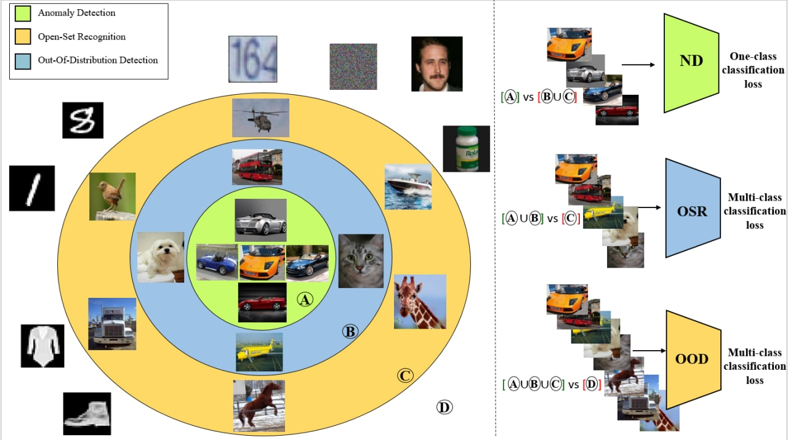

# OSR OOD AD Methods

This is the official repository for the paper [A Unified Survey on Anomaly, Novelty, Open-Set, and Out-of-Distribution Detection: Solutions and Future Challenges](https://arxiv.org/abs/2110.14051).

In this repo, we aim to implement different methods proposed for Anomaly Detection, Novelty Detection, Out-of-Distribution Detection, and Open-Set Recognition.

A curated list of these methods are available at [here](https://github.com/hoya012/awesome-anomaly-detection) and [here](https://github.com/iCGY96/awesome_OpenSetRecognition_list#open-set-recognition).

## Datasets
### 1. Semantic-level Datasets
- MNIST
- Fashion MNIST
- CIFAR-10
- CIFAR-100
- TinyImageNet
- LSUN
- COIL-100
- SVHN
- Flowers
- Birds

### 2. Pixel-level Datasets
- MVTec AD
- PCB
- LaceAD
- Retinal-OCT
- CAMELYON16
- Chest X-Rays
- Species
- ImageNet-O

### 3. Synthetic Datasets
- MNIST-C
- ImageNet-C, ImageNet-P

## Evaluation
- AUC-ROC
- FPR@TPR
- AUPR
- Accuracy
- F-measure

## Benchmarks
**OOD example detection - CIFAR10 as Inlier distribution**
<table>
    <thead>
        <tr>
            <th>Method</th>
            <th>Criterion</th>
            <th>Gaussian</th>
            <th>Rademacher</th>
            <th>Blob</th>
            <th>TinyImageNet(Crop)</th>
            <th>TinyImageNet(resize)</th>
            <th>LSUN(crop)</th>
            <th>LSUN(resize)</th>
            <th>iSUN</th>
            <th>SVHN</th>
            <th>CIFAR-100</th>
        </tr>
    </thead>
    <tbody>
        <tr>
            <td rowspan=3>MSP</td>
            <td>FPR95</td>
            <td>14.53</td>
            <td>94.78</td>
            <td>70.50</td>
            <td>17.06</td>
            <td>40.10</td>
            <td>12.65</td>
            <td>29.23</td>
            <td>36.22</td>
            <td>28.37</td>
            <td>43.27</td>
        </tr>
        <tr>
            <td>AUROC</td>
            <td>94.78</td>
            <td>79.85</td>
            <td>94.63</td>
            <td>94.64</td>
            <td>88.30</td>
            <td>96.45</td>
            <td>91.40</td>
            <td>90.00</td>
            <td>91.94</td>
            <td>87.77</td>
        </tr>
        <tr>
            <td>AUPR</td>
            <td>70.50</td>
            <td>32.21</td>
            <td>74.23</td>
            <td>75.09</td>
            <td>58.15</td>
            <td>83.16</td>
            <td>65.36</td>
            <td>62.46</td>
            <td>67.10</td>
            <td>55.68</td>
        </tr>
        <tr>
            <td rowspan=3>MLV</td>
            <td>FPR95</td>
            <td>52.60</td>
            <td>73.27</td>
            <td>11.67</td>
            <td>9.59</td>
            <td>47.67</td>
            <td>4.93</td>
            <td>27.28</td>
            <td>36.42</td>
            <td>43.54</td>
            <td>56.52</td>
        </tr>
        <tr>
            <td>AUROC</td>
            <td>75.48</td>
            <td>70.08</td>
            <td>96.85</td>
            <td>97.84</td>
            <td>89.16</td>
            <td>98.93</td>
            <td>94.05</td>
            <td>93.38</td>
            <td>91.11</td>
            <td>87.13</td>
        </tr>
        <tr>
            <td>AUPR</td>
            <td>27.07</td>
            <td>25.47</td>
            <td>83.56</td>
            <td>90.31</td>
            <td>65.65</td>
            <td>95.35</td>
            <td>78.18</td>
            <td>73.99</td>
            <td>72.08</td>
            <td>61.47</td>
        </tr>
        <tr>
            <td rowspan=3>MSP-OE</td>
            <td>FPR95</td>
            <td>0.71</td>
            <td>0.50</td>
            <td>0.58</td>
            <td>6.61</td>
            <td>13.00</td>
            <td>1.32</td>
            <td>5.16</td>
            <td>5.64</td>
            <td>4.77</td>
            <td>28.36</td>
        </tr>
        <tr>
            <td>AUROC</td>
            <td>99.60</td>
            <td>99.78</td>
            <td>99.84</td>
            <td>98.77</td>
            <td>97.27</td>
            <td>99.70</td>
            <td>98.95</td>
            <td>98.87</td>
            <td>98.42</td>
            <td>93.29</td>
        </tr>
        <tr>
            <td>AUPR</td>
            <td>94.25</td>
            <td>97.36</td>
            <td>98.94</td>
            <td>95.06</td>
            <td>88.08</td>
            <td>98.56</td>
            <td>94.56</td>
            <td>94.20</td>
            <td>89.33</td>
            <td>76.19</td>
        </tr>
        <tr>
            <td rowspan=3>MLV-OE</td>
            <td>FPR95</td>
            <td>0.69</td>
            <td>0.43</td>
            <td>0.49</td>
            <td>4.98</td>
            <td>11.17</td>
            <td>1.11</td>
            <td>4.10</td>
            <td>4.52</td>
            <td>4.08</td>
            <td>30.38</td>
        </tr>
        <tr>
            <td>AUROC</td>
            <td>99.62</td>
            <td>99.79</td>
            <td>99.86</td>
            <td>98.96</td>
            <td>97.58</td>
            <td>99.74</td>
            <td>99.11</td>
            <td>99.02</td>
            <td>98.61</td>
            <td>93.10</td>
        </tr>
        <tr>
            <td>AUPR</td>
            <td>94.30</td>
            <td>97.46</td>
            <td>99.07</td>
            <td>95.72</td>
            <td>89.10</td>
            <td>98.71</td>
            <td>95.15</td>
            <td>94.68</td>
            <td>90.11</td>
            <td>76.36</td>
        </tr>
        <tr>
            <td rowspan=3>Ensemble</td>
            <td>FPR95</td>
            <td>6.84</td>
            <td>16.71</td>
            <td>16.71</td>
            <td>15.99</td>
            <td>100</td>
            <td>12.34</td>
            <td>25.04</td>
            <td>100.00</td>
            <td>16.71</td>
            <td>100.00</td>
        </tr>
        <tr>
            <td>AUROC</td>
            <td>97.37</td>
            <td>86.94</td>
            <td>91.20</td>
            <td>93.18</td>
            <td>85.69</td>
            <td>95.23</td>
            <td>90.21</td>
            <td>88.00</td>
            <td>92.05</td>
            <td>83.90</td>
        </tr>
        <tr>
            <td>AUPR</td>
            <td>82.32</td>
            <td>41.71</td>
            <td>64.52</td>
            <td>71.49</td>
            <td>56.32</td>
            <td>78.07</td>
            <td>64.99</td>
            <td>61.03</td>
            <td>67.29</td>
            <td>53.00</td>
        </tr>
        <tr>
            <td rowspan=3>Mahalanobis</td>
            <td>FPR95</td>
            <td>1.35</td>
            <td>2.01</td>
            <td>7.38</td>
            <td>35.82</td>
            <td>48.38</td>
            <td>28.61</td>
            <td>27.98</td>
            <td>39.02</td>
            <td>24.79</td>
            <td>48.40</td>
        </tr>
        <tr>
            <td>AUROC</td>
            <td>99.57</td>
            <td>99.60</td>
            <td>98.21</td>
            <td>87.78</td>
            <td>87.75</td>
            <td>87.10</td>
            <td>92.25</td>
            <td>90.40</td>
            <td>90.86</td>
            <td>86.71</td>
        </tr>
        <tr>
            <td>AUPR</td>
            <td>96.49</td>
            <td>97.95</td>
            <td>90.63</td>
            <td>46.79</td>
            <td>55.33</td>
            <td>41.59</td>
            <td>65.14</td>
            <td>62.17</td>
            <td>53.36</td>
            <td>54.06</td>
        </tr>
        <tr>
            <td rowspan=3>MC-Dropout</td>
            <td>FPR95</td>
            <td>15.31</td>
            <td>33.58</td>
            <td>16.54</td>
            <td>20.75</td>
            <td>38.77</td>
            <td>16.81</td>
            <td>28.44</td>
            <td>34.62</td>
            <td>28.73</td>
            <td>37.48</td>
        </tr>
        <tr>
            <td>AUROC</td>
            <td>93.89</td>
            <td>83.41</td>
            <td>94.73</td>
            <td>93.55</td>
            <td>88.52</td>
            <td>95.09</td>
            <td>91.36</td>
            <td>89.73</td>
            <td>91.07</td>
            <td>88.43</td>
        </tr>
        <tr>
            <td>AUPR</td>
            <td>63.52</td>
            <td>35.40</td>
            <td>74.91</td>
            <td>71.65</td>
            <td>58.19</td>
            <td>77.26</td>
            <td>65.34</td>
            <td>61.76</td>
            <td>62.41</td>
            <td>56.84</td>
        </tr>
        <tr>
            <td rowspan=3>ODIN</td>
            <td>FPR95</td>
            <td>0.00</td>
            <td>0.00</td>
            <td>99.4</td>
            <td>04.30</td>
            <td>07.50</td>
            <td>04.80</td>
            <td>03.80</td>
            <td>06.10</td>
            <td>51.00</td>
            <td>51.40</td>
        </tr>
        <tr>
            <td>AUROC</td>
            <td>100.00</td>
            <td>99.90</td>
            <td>42.50</td>
            <td>99.10</td>
            <td>98.50</td>
            <td>99.00</td>
            <td>99.20</td>
            <td>98.80</td>
            <td>89.90</td>
            <td>88.3</td>
        </tr>
        <tr>
            <td>AUPR</td>
            <td>63.52</td>
            <td>35.40</td>
            <td>74.91</td>
            <td>71.65</td>
            <td>58.19</td>
            <td>77.26</td>
            <td>65.34</td>
            <td>61.76</td>
            <td>62.41</td>
            <td>56.84</td>
        </tr>
    </tbody>
</table>

**OOD example detection - CIFAR100 as Inlier distribution**
<table>
    <thead>
        <tr>
            <th>Method</th>
            <th>Criterion</th>
            <th>Gaussian</th>
            <th>Rademacher</th>
            <th>Blob</th>
            <th>TinyImageNet(Crop)</th>
            <th>TinyImageNet(resize)</th>
            <th>LSUN(crop)</th>
            <th>LSUN(resize)</th>
            <th>iSUN</th>
            <th>SVHN</th>
            <th>CIFAR-10</th>
        </tr>
    </thead>
    <tbody>
        <tr>
            <td rowspan=3>MSP</td>
            <td>FPR95</td>
            <td>54.32</td>
            <td>39.08</td>
            <td>57.11</td>
            <td>43.34</td>
            <td>65.88</td>
            <td>47.32</td>
            <td>62.98</td>
            <td>63.34</td>
            <td>69.12</td>
            <td>65.14</td>
        </tr>
        <tr>
            <td>AUROC</td>
            <td>64.66</td>
            <td>79.27</td>
            <td>75.61</td>
            <td>86.34</td>
            <td>74.56</td>
            <td>85.56</td>
            <td>75.59</td>
            <td>75.73</td>
            <td>71.43</td>
            <td>75.12</td>
        </tr>
        <tr>
            <td>AUPR</td>
            <td>19.69</td>
            <td>30.05</td>
            <td>29.99</td>
            <td>56.98</td>
            <td>33.71</td>
            <td>56.49</td>
            <td>34.11</td>
            <td>33.88</td>
            <td>30.44</td>
            <td>33.92</td>
        </tr>
        <tr>
            <td rowspan=3>ODIN</td>
            <td>FPR95</td>
            <td>01.20</td>
            <td>13.90</td>
            <td>13.70</td>
            <td>09.20</td>
            <td>37.60</td>
            <td>07.20</td>
            <td>32.30</td>
            <td>36.40</td>
            <td>37.00</td>
            <td>76.4</td>
        </tr>
        <tr>
            <td>AUROC</td>
            <td>99.50</td>
            <td>92.60</td>
            <td>95.90</td>
            <td>97.90</td>
            <td>90.80</td>
            <td>98.30</td>
            <td>91.90</td>
            <td>90.50</td>
            <td>89.00</td>
            <td>73.20</td>
        </tr>
        <tr>
            <td>AUPR</td>
            <td>98.70</td>
            <td>83.70</td>
            <td>94.50</td>
            <td>97.70</td>
            <td>89.90</td>
            <td>98.20</td>
            <td>90.90</td>
            <td>87.80</td>
            <td>86.30</td>
            <td>70.60</td>
        </tr>
        <tr>
            <td rowspan=3>MLV</td>
            <td>FPR95</td>
            <td>71.89</td>
            <td>72.35</td>
            <td>81.09</td>
            <td>22.51</td>
            <td>66.17</td>
            <td>22.20</td>
            <td>61.30</td>
            <td>60.86</td>
            <td>67.01</td>
            <td>64.41</td>
        </tr>
        <tr>
            <td>AUROC</td>
            <td>44.24</td>
            <td>46.22</td>
            <td>53.62</td>
            <td>94.72</td>
            <td>77.72</td>
            <td>95.09</td>
            <td>79.54</td>
            <td>79.19</td>
            <td>74.03</td>
            <td>77.55</td>
        </tr>
        <tr>
            <td>AUPR</td>
            <td>13.82</td>
            <td>14.20</td>
            <td>15.98</td>
            <td>79.10</td>
            <td>38.00</td>
            <td>81.11</td>
            <td>39.14</td>
            <td>37.27</td>
            <td>31.99</td>
            <td>37.30</td>
        </tr>
        <tr>
            <td rowspan=3>MSP-OE</td>
            <td>FPR95</td>
            <td>12.41</td>
            <td>16.89</td>
            <td>12.04</td>
            <td>22.02</td>
            <td>69.42</td>
            <td>13.27</td>
            <td>60.89</td>
            <td>62.42</td>
            <td>43.10</td>
            <td>62.57</td>
        </tr>
        <tr>
            <td>AUROC</td>
            <td>95.69</td>
            <td>93.01</td>
            <td>97.11</td>
            <td>95.69</td>
            <td>76.04</td>
            <td>97.55</td>
            <td>80.94</td>
            <td>79.96</td>
            <td>86.86</td>
            <td>75.41</td>
        </tr>
        <tr>
            <td>AUPR</td>
            <td>71.13</td>
            <td>56.81</td>
            <td>85.91</td>
            <td>85.34</td>
            <td>39.57</td>
            <td>90.99</td>
            <td>48.52</td>
            <td>45.86</td>
            <td>53.27</td>
            <td>32.28</td>
        </tr>
        <tr>
            <td rowspan=3>MLV-OE</td>
            <td>FPR95</td>
            <td>10.71</td>
            <td>16.66</td>
            <td>8.09</td>
            <td>17.34</td>
            <td>73.95</td>
            <td>08.50</td>
            <td>56.02</td>
            <td>60.73</td>
            <td>32.59</td>
            <td>64.91</td>
        </tr>
        <tr>
            <td>AUROC</td>
            <td>96.12</td>
            <td>91.86</td>
            <td>97.94</td>
            <td>96.38</td>
            <td>75.84</td>
            <td>98.31</td>
            <td>83.33</td>
            <td>81.89</td>
            <td>88.91</td>
            <td>73.74</td>
        </tr>
        <tr>
            <td>AUPR</td>
            <td>72.81</td>
            <td>52.03</td>
            <td>88.60</td>
            <td>86.55</td>
            <td>39.72</td>
            <td>92.90</td>
            <td>51.06</td>
            <td>48.21</td>
            <td>54.72</td>
            <td>30.48</td>
        </tr>
        <tr>
            <td rowspan=3>Ensemble</td>
            <td>FPR95</td>
            <td>22.72</td>
            <td>43.51</td>
            <td>48.07</td>
            <td>44.68</td>
            <td>100.00</td>
            <td>47.26</td>
            <td>100.00</td>
            <td>91.44</td>
            <td>57.18</td>
            <td>57.18</td>
        </tr>
        <tr>
            <td>AUROC</td>
            <td>89.15</td>
            <td>68.64</td>
            <td>79.24</td>
            <td>82.90</td>
            <td>70.47</td>
            <td>82.39</td>
            <td>70.66</td>
            <td>71.08</td>
            <td>73.61</td>
            <td>75.13</td>
        </tr>
        <tr>
            <td>AUPR</td>
            <td>46.45</td>
            <td>21.61</td>
            <td>35.80</td>
            <td>44.31</td>
            <td>28.98</td>
            <td>44.12</td>
            <td>28.75</td>
            <td>28.66</td>
            <td>31.76</td>
            <td>32.62</td>
        </tr>
        <tr>
            <td rowspan=3>Mahalanobis</td>
            <td>FPR95</td>
            <td>0.82</td>
            <td>0.10</td>
            <td>2.70</td>
            <td>73.79</td>
            <td>43.40</td>
            <td>76.42</td>
            <td>37.94</td>
            <td>42.07</td>
            <td>32.05</td>
            <td>70.80</td>
        </tr>
        <tr>
            <td>AUROC</td>
            <td>99.78</td>
            <td>99.98</td>
            <td>99.48</td>
            <td>57.77</td>
            <td>87.62</td>
            <td>54.35</td>
            <td>90.12</td>
            <td>88.91</td>
            <td>92.76</td>
            <td>70.99</td>
        </tr>
        <tr>
            <td>AUPR</td>
            <td>98.63</td>
            <td>99.88</td>
            <td>97.64</td>
            <td>17.27</td>
            <td>60.18</td>
            <td>16.11</td>
            <td>65.97</td>
            <td>62.82</td>
            <td>75.87</td>
            <td>27.12</td>
        </tr>
        <tr>
            <td rowspan=3>MC-Dropout</td>
            <td>FPR95</td>
            <td>54.45</td>
            <td>41.41</td>
            <td>46.64</td>
            <td>47.32</td>
            <td>68.05</td>
            <td>55.38</td>
            <td>63.53</td>
            <td>65.03</td>
            <td>75.98</td>
            <td>63.33</td>
        </tr>
        <tr>
            <td>AUROC</td>
            <td>62.35</td>
            <td>76.51</td>
            <td>80.59</td>
            <td>85.23</td>
            <td>73.66</td>
            <td>82.24</td>
            <td>74.93</td>
            <td>74.70</td>
            <td>68.89</td>
            <td>76.87</td>
        </tr>
        <tr>
            <td>AUPR</td>
            <td>18.74</td>
            <td>27.14</td>
            <td>35.08</td>
            <td>54.12</td>
            <td>32.57</td>
            <td>49.08</td>
            <td>33.04</td>
            <td>32.26</td>
            <td>28.63</td>
            <td>36.31</td>
        </tr>
    </tbody>
</table>

**OOD example detection - TinyImageNet as Inlier distribution**
<table>
    <thead>
        <tr>
            <th>Method</th>
            <th>Criterion</th>
            <th>Gaussian</th>
            <th>Rademacher</th>
            <th>Blob</th>
            <th>LSUN(crop)</th>
            <th>LSUN(resize)</th>
            <th>iSUN</th>
            <th>SVHN</th>
        </tr>
    </thead>
    <tbody>
        <tr>
            <td rowspan=3>MSP</td>
            <td>FPR95</td>
            <td>72.34</td>
            <td>47.60</td>
            <td>90.31</td>
            <td>29.33</td>
            <td>44.37</td>
            <td>45.68</td>
            <td>44.75</td>
        </tr>
        <tr>
            <td>AUROC</td>
            <td>33.36</td>
            <td>70.52</td>
            <td>22.79</td>
            <td>93.66</td>
            <td>86.16</td>
            <td>85.94</td>
            <td>89.05</td>
        </tr>
        <tr>
            <td>AUPR</td>
            <td>12.27</td>
            <td>22.76</td>
            <td>10.55</td>
            <td>77.91</td>
            <td>50.79</td>
            <td>51.16</td>
            <td>67.21</td>
        </tr>
        <tr>
            <td rowspan=3>ODIN</td>
            <td>FPR95</td>
            <td>43.70</td>
            <td>59.40</td>
            <td>74.60</td>
            <td>14.80</td>
            <td>38.90</td>
            <td>38.90</td>
            <td>23.70</td>
        </tr>
        <tr>
            <td>AUROC</td>
            <td>70.00</td>
            <td>50.80</td>
            <td>46.20</td>
            <td>96.80</td>
            <td>87.10</td>
            <td>87.60</td>
            <td>93.90</td>
        </tr>
        <tr>
            <td>AUPR</td>
            <td>56.60</td>
            <td>45.10</td>
            <td>43.10</td>
            <td>96.60</td>
            <td>83.10</td>
            <td>87.60</td>
            <td>92.80</td>
        </tr>
        <tr>
            <td rowspan=3>MLV</td>
            <td>FPR95</td>
            <td>67.38</td>
            <td>21.56</td>
            <td>97.58</td>
            <td>10.96</td>
            <td>28.53</td>
            <td>27.80</td>
            <td>27.51</td>
        </tr>
        <tr>
            <td>AUROC</td>
            <td>45.34</td>
            <td>90.24</td>
            <td>15.96</td>
            <td>97.75</td>
            <td>91.71</td>
            <td>91.98</td>
            <td>94.09</td>
        </tr>
        <tr>
            <td>AUPR</td>
            <td>14.15</td>
            <td>49.31</td>
            <td>9.77</td>
            <td>91.22</td>
            <td>64.00</td>
            <td>66.12</td>
            <td>79.28</td>
        </tr>
        <tr>
            <td rowspan=3>MSP-OE</td>
            <td>FPR95</td>
            <td>45.32</td>
            <td>49.53</td>
            <td>0.05</td>
            <td>0.53</td>
            <td>0.12</td>
            <td>0.12</td>
            <td>0.39</td>
        </tr>
        <tr>
            <td>AUROC</td>
            <td>76.30</td>
            <td>65.11</td>
            <td>99.99</td>
            <td>99.76</td>
            <td>99.97</td>
            <td>99.97</td>
            <td>99.83</td>
        </tr>
        <tr>
            <td>AUPR</td>
            <td>28.32</td>
            <td>19.97</td>
            <td>99.93</td>
            <td>98.37</td>
            <td>99.82</td>
            <td>99.79</td>
            <td>98.16</td>
        </tr>
        <tr>
            <td rowspan=3>MLV-OE</td>
            <td>FPR95</td>
            <td>11.21</td>
            <td>46.46</td>
            <td>0.05</td>
            <td>0.52</td>
            <td>0.11</td>
            <td>0.12</td>
            <td>0.38</td>
        </tr>
        <tr>
            <td>AUROC</td>
            <td>95.45</td>
            <td>68.30</td>
            <td>99.99</td>
            <td>99.81</td>
            <td>99.97</td>
            <td>99.97</td>
            <td>99.83</td>
        </tr>
        <tr>
            <td>AUPR</td>
            <td>66.66</td>
            <td>21.45</td>
            <td>99.93</td>
            <td>98.48</td>
            <td>99.81</td>
            <td>99.79</td>
            <td>98.16</td>
        </tr>
        <tr>
            <td rowspan=3>Ensemble</td>
            <td>FPR95</td>
            <td>71.09</td>
            <td>45.96</td>
            <td>78.16</td>
            <td>46.55</td>
            <td>57.62</td>
            <td>58.94</td>
            <td>54.60</td>
        </tr>
        <tr>
            <td>AUROC</td>
            <td>35.75</td>
            <td>74.09</td>
            <td>51.86</td>
            <td>83.72</td>
            <td>76.54</td>
            <td>75.70</td>
            <td>77.09</td>
        </tr>
        <tr>
            <td>AUPR</td>
            <td>12.61</td>
            <td>25.61</td>
            <td>15.70</td>
            <td>50.66</td>
            <td>34.67</td>
            <td>33.48</td>
            <td>34.89</td>
        </tr>
        <tr>
            <td rowspan=3>Mahalanobis</td>
            <td>FPR95</td>
            <td>66.87</td>
            <td>48.15</td>
            <td>22.23</td>
            <td>98.46</td>
            <td>72.04</td>
            <td>79.93</td>
            <td>96.83</td>
        </tr>
        <tr>
            <td>AUROC</td>
            <td>48.74</td>
            <td>70.28</td>
            <td>92.41</td>
            <td>13.33</td>
            <td>71.11</td>
            <td>66.65</td>
            <td>27.59</td>
        </tr>
        <tr>
            <td>AUPR</td>
            <td>14.78</td>
            <td>22.60</td>
            <td>62.45</td>
            <td>9.48</td>
            <td>28.17</td>
            <td>25.19</td>
            <td>10.81</td>
        </tr>
        <tr>
            <td rowspan=3>MC-Dropout</td>
            <td>FPR95</td>
            <td>76.09</td>
            <td>56.14</td>
            <td>91.36</td>
            <td>30.44</td>
            <td>43.25</td>
            <td>47.22</td>
            <td>47.67</td>
        </tr>
        <tr>
            <td>AUROC</td>
            <td>30.38</td>
            <td>58.92</td>
            <td>21.31</td>
            <td>93.13</td>
            <td>85.68</td>
            <td>84.45</td>
            <td>87.44</td>
        </tr>
        <tr>
            <td>AUPR</td>
            <td>11.82</td>
            <td>17.54</td>
            <td>10.39</td>
            <td>76.53</td>
            <td>48.49</td>
            <td>46.56</td>
            <td>62.24</td>
        </tr>
    </tbody>
</table>
